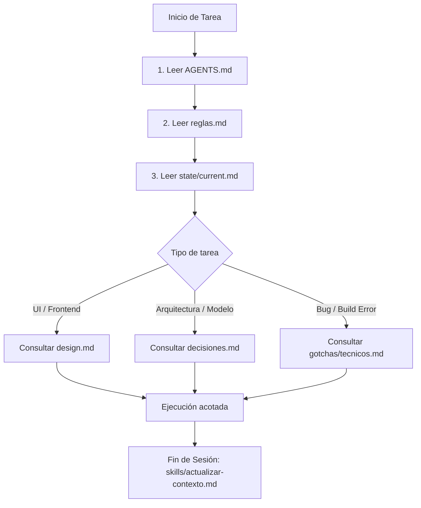

# AGENTS.md · Control Central de Bolsillo

> **Identidad:** Bolsillo es una web app mobile-first para el control ágil de finanzas personales en pesos chilenos (CLP). Su premisa es permitir registrar gastos en menos de 15 segundos y consultar el disponible semanal sin fricciones ni jerga bancaria.

---

## 1. Reglas Duras del Sistema de Agentes
1. **La memoria real vive en archivos, no en el context window.** Lo que no esté en disco, no existe para la siguiente sesión.
2. **Carga solo lo estrictamente necesario para la tarea actual.** No leas todo el repositorio si solo vas a cambiar un botón.
3. **Referencia archivos en vez de pegar contenido largo en el prompt.** Usa rutas relativas/absolutas.
4. **Al cerrar sesión: ejecuta el protocolo de actualización.** Actualiza `state/`, registra decisiones en `decisions/` y comprime la sesión en `logs/`.

---

## 2. Punteros y Mapa de Contexto
El sistema de contexto está dividido en módulos de alta cohesión y bajo acoplamiento:

| Directorio / Archivo | Propósito | Cuándo consultarlo |
| :--- | :--- | :--- |
| [`reglas.md`](./reglas.md) | Reglas técnicas y de producto inviolables y detectables. | **Siempre** antes de escribir código. |
| [`design.md`](./design.md) | Sistema de diseño, tokens, tipografías y principios UX. | En cambios de UI, maquetación o componentes. |
| [`decisiones.md`](./decisiones.md) | Resumen e índice de ADRs (decisiones de arquitectura). | Antes de proponer refactors o nuevas librerías. |
| [`decisions/`](./decisions/) | Archivos ADR individuales con fecha y justificación. | Para entender el contexto histórico de una decisión. |
| [`state/`](./state/) | Estado actual de desarrollo: completado, pendiente, blockers. | Al iniciar y finalizar cada sesión. |
| [`gotchas/`](./gotchas/) | Trampas técnicas, incompatibilidades y soluciones probadas. | Al depurar errores o configurar build/libs. |
| [`logs/`](./logs/) | Bitácoras comprimidas de sesiones pasadas. | Para auditar qué se hizo en sesiones previas. |
| [`skills/`](./skills/) | Procedimientos y flujos repetibles (ej: cierre de sesión). | Al terminar una sesión de trabajo. |

---

## 3. Orden de Lectura Obligatorio
Para trabajar en este repositorio sin consumir contexto innecesario, sigue este flujo:

---

## 4. Enrutador de Tareas y Skills
- **Crear / modificar componentes de interfaz:** Consultar [`design.md`](./design.md). Respetar contenedor móvil `max-w-md` y fuentes Outfit/Inter.
- **Modificar cálculo de dinero o tipos:** Consultar [`src/types.ts`](./src/types.ts) y [`reglas.md`](./reglas.md). Nunca usar decimales en CLP.
- **Configurar build / dependencias:** Revisar [`gotchas/tecnicos.md`](./gotchas/tecnicos.md). Recordar Tailwind v4 (`@theme`) y `motion/react`.
- **Cierre de sesión de trabajo:** Ejecutar obligatoriamente el skill [`skills/actualizar-contexto.md`](./skills/actualizar-contexto.md).

---

## 5. Definition of Done (DoD)
Una tarea se considera completada únicamente si cumple con los siguientes 6 puntos:

1. **Type Check:** `npm run lint` (o `npx tsc --noEmit`) termina con 0 errores.
2. **Build Limpio:** `npm run build` genera la salida sin advertencias de dependencias rotas.
3. **Formato CLP Intacto:** Todos los valores monetarios respetan el formato chileno sin decimales (`$XX.XXX`).
4. **Contenedor Mobile-First:** La vista se renderiza dentro de `max-w-md mx-auto` con padding de seguridad para el BottomNav (`pb-28` o `pb-safe`).
5. **Cero Violaciones de `reglas.md`:** No usar `framer-motion`, no agregar `tailwind.config.js`, no usar `any`.
6. **Memoria Actualizada:** `state/current.md` refleja el nuevo estado del proyecto.
